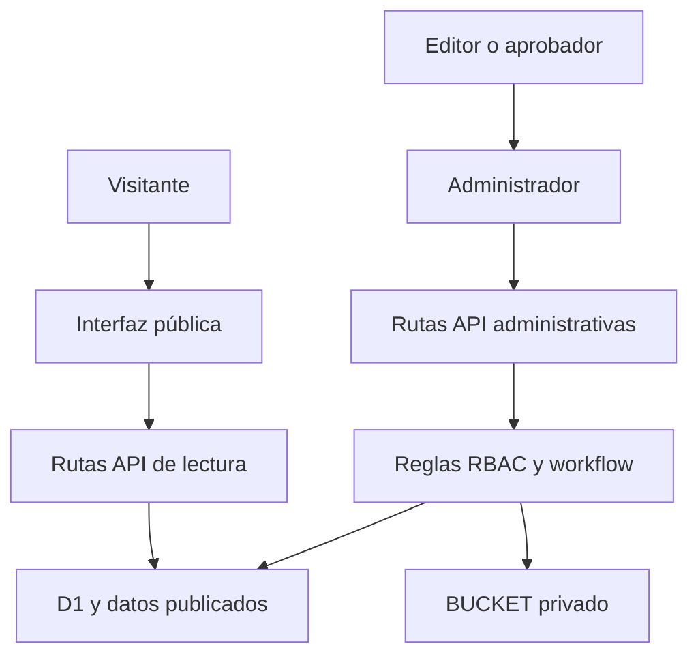

# Arquitectura

## Límites del sistema

El sitio público y el CMS comparten una sola aplicación. La interfaz no autoriza acciones por sí misma: las rutas del servidor validan identidad, rol y alcance por operación estadística antes de escribir en D1 o acceder a archivos privados.

## Capas

| Capa | Ubicación | Responsabilidad |
| --- | --- | --- |
| Presentación pública | `app/page.tsx`, componentes de `app/` | Navegación, relatos, productos y recursos. |
| Administrador | `app/admin/` | Gestión de páginas, contenidos, fuentes, archivos, variables y períodos. |
| API | `app/api/` | Lectura de datos, publicaciones, SDMX y acciones administrativas. |
| Dominio | `lib/` | Políticas, validación, consultas, caché y coordinación editorial. |
| Persistencia | `db/`, `drizzle/` | Esquema D1 y cambios versionados. |
| Archivos | `public/`, `BUCKET` | Datos y documentos públicos; archivos privados del CMS. |

## Modelo editorial

Una operación estadística contiene páginas. Cada página y fuente tiene versiones. Los componentes de una página declaran su tipo y configuración, y pueden vincular una o más fuentes. Las publicaciones y archivos mantienen su propio ciclo de vida y no se exponen al público hasta que una versión autorizada cumple su fecha de publicación.

El modelo heredado de publicaciones se conserva durante la transición. La lectura editorial se activa por operación y puede volver al modo heredado para recuperación controlada.

## Convenciones relevantes

- Fechas almacenadas en UTC y presentadas en `America/Santiago`.
- Slugs y rutas públicas deben mantenerse estables.
- Toda modificación persistente debe quedar en una migración nueva; no se reescriben migraciones aplicadas.
- Componentes admitidos mediante registro y esquemas; no se acepta HTML, CSS o JavaScript arbitrario desde el CMS.

